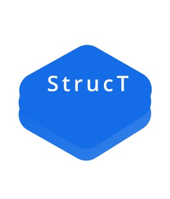

  <h1>
     
     
   
     
    Data structures library
     
     
     
     
  </h1>
  
     
     
    
    
     
    Collection of essential data structures for web development.</em></a>.

  
   
   
   
   
  <pre>yarn add <a href="https://www.npmjs.com/package/@zmitry/struct">@zmitry/struct</a></pre>
   
   
   

- [**Graph**](./src/graph/Readme.md)
  - [`createGraph`](./src/graph/Readme.md) &mdash; graph data structure
  - [`createCompoundGraph`](./src/graph/Readme.md) &mdash; hierarchal graph
     
     
- [**Primitive**](./src/index.ts)
  - [`createHeap`](./src/pairing-heap.ts) &mdash; Pairing heap implementation.
  - [`LRUCache`](./src/LRUCache.ts) &mdash; LRU cache implementation
     
     

 
 
 
 
 
 
 

  <a href="./docs/Usage.md"><strong>Usage</strong></a> &mdash; how to import.
   
  <a href="https://opencollective.com/@zmitry/struct/contribute"><strong>Support</strong></a> &mdash; add yourself to backer list below.

 
 
 
 
 

[img-demo]: https://img.shields.io/badge/demo-%20%20%20%F0%9F%9A%80-green.svg

 
 
 
 
 

<h2>Roadmap</h2>

- LRU Cache
- LRU with ttl
- Graph data structure without parent/multigraph support
- Topological sort
- Pairing heap simple
- Pairing heap using linked list
- Priority queue
- link-cut tree
